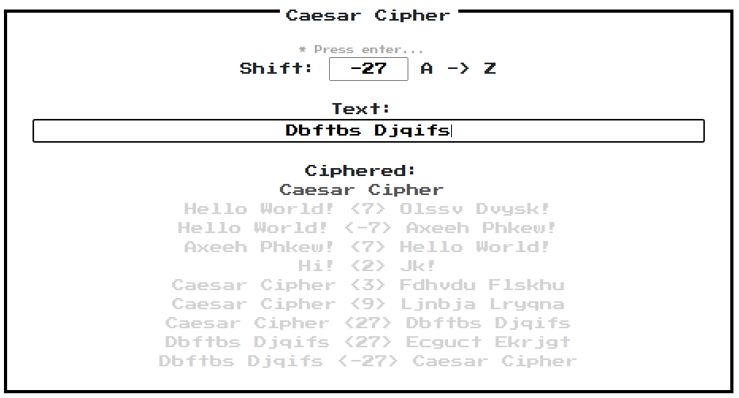

## Caesar Cipher

Caesar Cipher app made with Vue.js. Used [NES.css](https://nostalgic-css.github.io/NES.css/) for styles.

Can shift letters positive(right) or negative(left).

[View on the web](https://www.jioneeu.com/projects/caesar_cipher/index.html)

